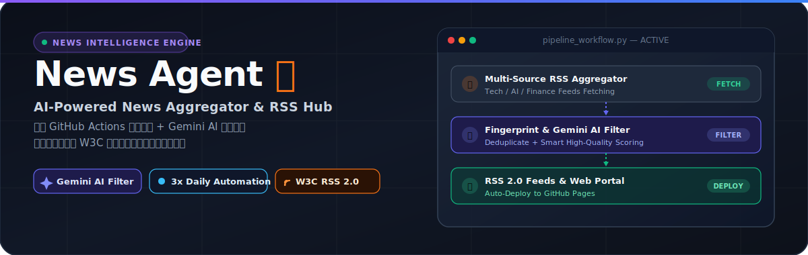
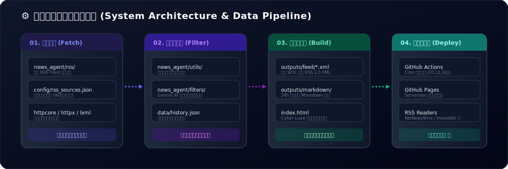

<p align="center">
  
</p>

<p align="center">
  <a href="https://github.com/zskfree/News-Agent/actions"></a>
  <a href="https://zskksz.asia/News-Agent"></a>
  <a href="https://python.org"></a>
  <a href="./LICENSE"></a>
  <a href="https://w3.org/schemas/rss"></a>
</p>

<p align="center">
  <b>[ <a href="#-english">English</a> | <a href="#-中文简述">中文简述</a> | <a href="#-current-feeds--当前订阅源">订阅源列表</a> | <a href="#-system-architecture--系统架构">系统架构</a> | <a href="#-quick-start--快速开始">快速开始</a> ]</b>
</p>

---

## 🌐 English

**News Agent** is an automated, multi-category news aggregator and W3C RSS 2.0 feed generator. Powered by **GitHub Actions** for serverless scheduled execution, **Gemini AI** for intelligent quality content filtering, and content fingerprinting for smart deduplication.

* **🌐 Live Web Portal**: [https://zskksz.asia/News-Agent](https://zskksz.asia/News-Agent)
* **⏰ Schedule**: 3 Automated Runs Daily (CST `07:00`, `12:00`, `16:00`)
* **📡 Output Standard**: W3C Compliant RSS 2.0 Feeds + Daily Markdown Digest

---

## 🇨🇳 中文简述

**News Agent** 是一个基于 Python 3.12 构建的高效自动化新闻聚合与 RSS 2.0 订阅源生成系统。通过 **GitHub Actions** 实现无服务器全自动运行，配合 **Gemini AI** 智能过滤高质量资讯，并采用内容指纹去重算法，为您提供干净、优质、定时的多分类新闻订阅服务。

---

## 📊 Current Feeds / 当前订阅源

可以直接在 Inoreader, NetNewsWire, Readwise 等任意 RSS 客户端中导入以下订阅地址：

| 分类 (Category) | RSS 订阅源地址 (Feed URL) | 更新频率 | 状态 |
| :--- | :--- | :---: | :---: |
| 🤖 **AI - 人工智能** | `https://zskksz.asia/News-Agent/feed/aifreenewsagent.xml` | 每日 3 次 |  |
| 💻 **Technology - 前沿科技** | `https://zskksz.asia/News-Agent/feed/technologyfreenewsagent.xml` | 每日 3 次 |  |
| 💰 **Finance - 财经市场** | `https://zskksz.asia/News-Agent/feed/financefreenewsagent.xml` | 每日 3 次 |  |

---

## ⚙️ System Architecture / 系统架构

<p align="center">
  
</p>

---

## ✨ Key Features / 项目亮点

- 🏗️ **模块化架构** — 全新 Python 包结构 (`news_agent/`)，解耦 RSS 抓取、AI 筛选与格式生成，易于扩充新源。
- 🔄 **智能内容去重** — 基于内容指纹与哈希的比对算法，彻底解决多源重复抓取问题。
- 🤖 **Gemini AI 提纯** — 集成 Google Gemini AI，对新闻标题与摘要进行评分与高价值内容提纯。
- 📡 **标准 RSS 2.0 协议** — 生成符合 W3C 标准的 RSS 2.0 XML 文件，兼容各大主流 RSS 阅读器。
- ⚡ **无服务器自动运行** — 利用 GitHub Actions 实现零成本定时自动运行，部署发布至 GitHub Pages。
- 🎨 **Cyber-Luxe Web 门户** — 内置现代化响应式前端展示页面，支持浏览器端直接浏览最新资讯。

---

## 🚀 Quick Start / 快速开始

### 1. 环境准备与依赖安装

建议使用 `uv` 包管理器（或标准 `pip`）：

```bash
# 使用 uv (推荐)
uv sync

# 或使用 pip
pip install -r requirements.txt
```

### 2. 本地执行与调试

```bash
# 1. 抓取所有历史源并进行指纹去重
python scripts/build_cumulative_news.py

# 2. 生成多分类增量 RSS Feed (XML)
python scripts/build_cumulative_feed.py

# 3. 生成过去 24 小时每日精选 Markdown 简报
python scripts/build_daily_markdown.py --hours 24
```

---

## 🤖 Automated Deployment / 自动化部署

只需 4 步，即可轻松搭建属于您自己的专属新闻聚合服务：

1. **Fork 仓库**：点击右上角 `Fork` 按钮将本项目 Fork 到您的 GitHub 账号。
2. **启用 Pages 托管**：进入项目 `Settings` ➔ `Pages` ➔ 选择 `Source: GitHub Actions`。
3. **配置 API Secret（可选）**：进入 `Settings` ➔ `Secrets and variables` ➔ `Actions`，添加 `GEMINI_API_KEY` 以开启 AI 智能筛选功能。
4. **自动运行**：GitHub Actions 将按照定时 Cron 计划（北京时间 7:00, 12:00, 16:00）自动抓取、筛选并发布到 Pages。

---

## 🛠️ Project Structure / 项目结构

```
News-Agent/
├── 📁 assets/
│   └── 📁 readme/             # README 原生 SVG 视觉资源 (Hero & Architecture)
├── 📁 news_agent/             # 核心 Python 包
│   ├── config_loader.py       # 统一配置加载器
│   ├── 📁 rss/                # RSS 抓取与解析模块
│   ├── 📁 filters/            # Gemini AI 内容评分与筛选
│   ├── 📁 history/            # 历史发布记录与防重存盘
│   └── 📁 utils/              # 指纹哈希算法与工具函数
├── 📁 scripts/                # CLI 入口构建脚本
├── 📁 config/                 # RSS 数据源与系统配置文件
├── 📁 data/                   # 持久化数据存储 (History/Cache)
├── 📁 outputs/                # 生成产物 (feed/*.xml & markdown/*.md)
├── index.html                 # Cyber-Luxe 风格 Web 门户首页
├── pyproject.toml             # uv / PEP 621 项目元数据
└── requirements.txt           # Python 依赖清单
```

---

## 📄 License & Support

本软件基于 [MIT License](LICENSE) 协议开源。

* **⭐ Support**: 如果这个项目对您有所帮助，欢迎点亮一张 **Star**！
* **🌐 Web Portal**: [Free News Agent Portal](https://zskksz.asia/News-Agent)
* **📧 Feedback**: 遇到问题或有新需求，欢迎提交 [GitHub Issues](https://github.com/zskfree/News-Agent/issues)。
